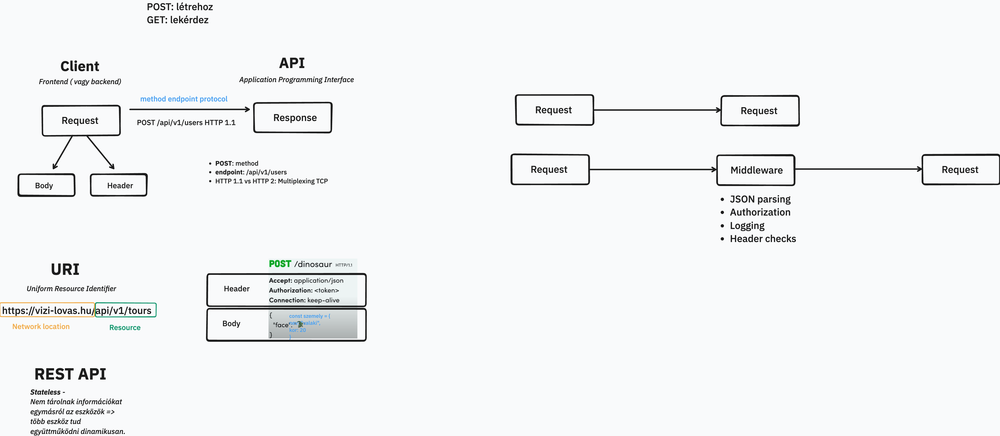

# Backend alapok



## Projekt felépítése

```bash
npm init -y 

npm install express dotenv nodemon
```

### .env fájl

Környezeti változókat tudunk biztonságosan meghatározni benne. 

Például, portszámot:

```env
PORT=3000
```

### package.json

Indító script hozzáadása:

```json
"type": "module",
"scripts": {
    "dev": "nodemon index.js"
  },
```

### server.js

Egy alap express szerver:

```javascript
import express from 'express';
import dotenv from 'dotenv';

dotenv.config();

const app = express();
const PORT = process.env.PORT || 3000;

app.listen(PORT, () => {
    console.log(`Server is running on port ${PORT}`);
});
```

### .gitignore

A .env fájlt és node_modules mappát ne töltsük fel a git-repo-ba:

```
node_modules
.env
```

## Routeok / végpontok

### GET

- Lekérdezés

```javascript
app.get('/', (req, res) => {
    res.send('Hello World!');
});
```

### POST

- Létrehozás
- 
```javascript
app.post('/', (req, res) => {
    res.send('POST request to the homepage');
});
```

### PUT

- Módosítás (teljes) - minden adatot cserél

```javascript
app.put('/user', (req, res) => {
    res.send('Got a PUT request at /user');
});
```

### PATCH

- Módosítás (részleges) - pl csak a nevet cseréli

```javascript
app.patch('/user', (req, res) => {
    res.send('Got a PATCH request at /user');
});
```

### DELETE

```javascript
app.delete('/user', (req, res) => {
    res.send('Got a DELETE request at /user');
});
```

### Paraméterek

```javascript
app.get('/users/:userId/books/:bookId', (req, res) => {
    const { userId, bookId } = req.params;
    res.send(`User ID: ${userId}, Book ID: ${bookId}`);
});
```


### Route kiszervezése

- routes/test.route.js
```javascript
import express from 'express';
const router = express.Router();

// localhost:3000 /test/ - ezt a /test-et a server.js-ben adtuk meg (lejjebb itt a leírásban)
router.get('/', (req, res) => {
    res.send('Hello World!');
});

export default router;
```

```javascript
import express from 'express';
import dotenv from 'dotenv';
import testRoute from './routes/test.route.js';

dotenv.config();

const app = express();
const PORT = process.env.PORT || 3000;

app.use('/test', testRoute); // localhost:3000 /test/

app.listen(PORT, () => {
    console.log(`Server is running on port ${PORT}`);
});
```

## Indítás

```bash
npm run dev
```

