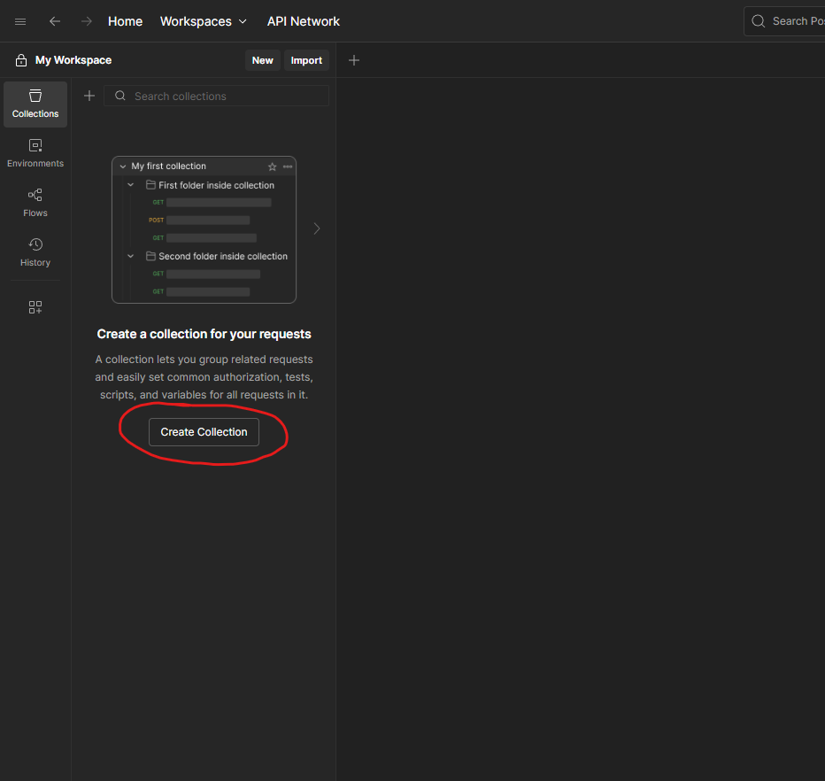
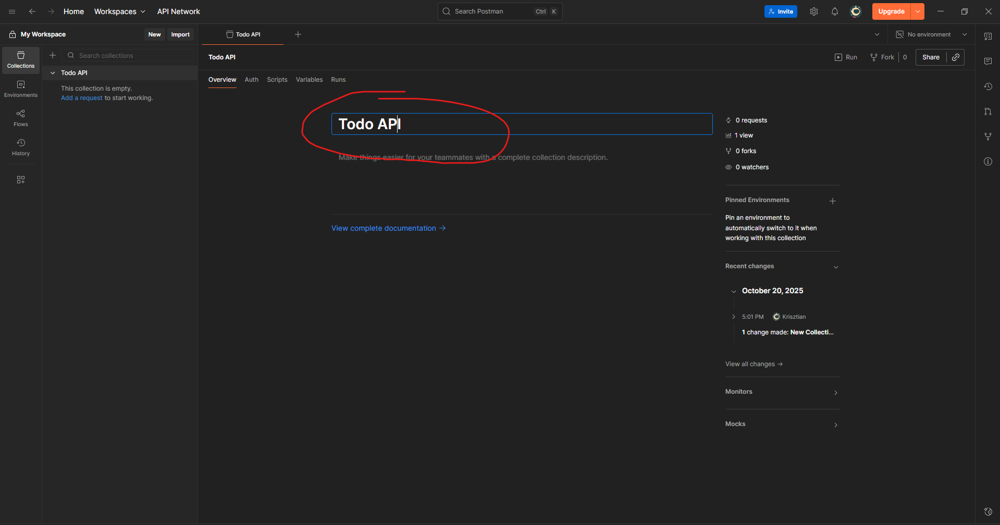
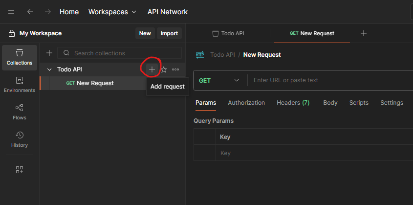
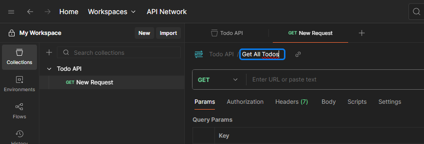
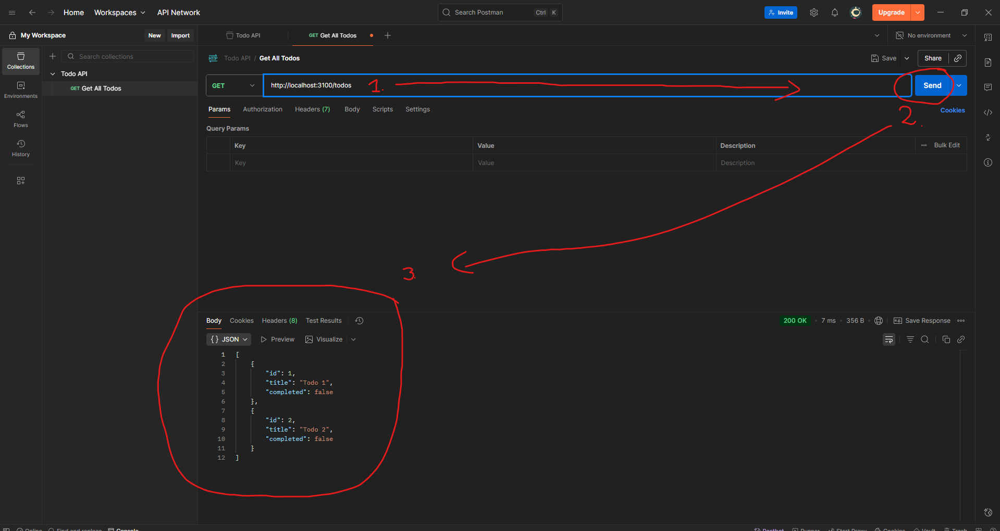

# Todo App (Express + Vite + TypeScript)

Ez egy egyszerű **Todo lista alkalmazás**, ami az Express.js és a Vite (vanilla TypeScript) technológiákat használja.  
A cél: bemutatni, hogyan kommunikál egy frontend egy backend REST API-val.

## Funkciók
- Új todo hozzáadása
- Lista megjelenítése
- Todo állapotának váltása (kész ↔ nem kész)
- Todo törlése

## Technológia
- **Backend:** Express.js, TypeScript
- **Frontend:** Vite (vanilla TypeScript)
- **Adatbázis:** In-memory tömb (szerver újraindítás után törlődik)

## Backend
## 🧩 1. Projekt előkészítése

A backend egy külön mappa lesz a frontendtől.
Készíts egy új mappát:

```bash
mkdir backend
cd backend
```

### Node.js inicializálása

```bash
npm init -y
```

Ez létrehoz egy `package.json` fájlt.

---

## ⚙️ 2. Express és szükséges csomagok telepítése

Telepítsük az **express**, **dotenv** és **cors** csomagokat:

```bash
npm install express dotenv cors
```

Ha szeretnéd, hogy automatikusan újrainduljon a szerver fejlesztés közben, telepítsd a `nodemon`-t is (fejlesztési függőségként):

```bash
npm install --save-dev nodemon
```

Majd a `package.json`-ban állíts be egy scriptet:

```json
"scripts": {
  "start": "node server.js",
  "dev": "nodemon server.js"
}
```

A `cors` csomag lehetővé teszi, hogy két eltérő domainről (frontend és backend) is elérjük az API-t, ha nem használjuk, a böngésző blokkolni fogja a kéréseket. Ebben akár azt is meghatározhatjuk, hogy explicit milyen domainekről engedélyezzük a hozzáférést.

---

## 🧱 3. Alap szerver létrehozása (`server.js`)

Először is hozzunk létre egy `.env` fájlt a környezeti változókhoz:

```env
PORT=3100
```

Hozz létre egy `server.js` fájlt a backend mappában:

```js
// server.js
import express from 'express';
import dotenv from 'dotenv';
import cors from 'cors';

dotenv.config();

const app = express();
const PORT = process.env.PORT || 3100;

// Köztes rétegek (middleware-ek)
app.use(express.json());
app.use(cors());

// Teszt útvonal
app.get('/', (req, res) => {
  res.send('A szerver működik!');
});

// Szerver indítása
app.listen(PORT, () => {
  console.log(`Szerver fut: http://localhost:${PORT}`);
});
```

Futtatás:

```bash
npm run dev
```

Ha a böngészőben megnyitod a `http://localhost:3100` címet, a “A szerver működik!” üzenetet kell látnod.

---

## ✅ 4. REST API útvonalak létrehozása

Hozzuk létre az API-t, ami kezeli a teendőket (todos).
Frissítsük a `server.js` fájlt:

```js
import express from 'express';
import dotenv from 'dotenv';
import cors from 'cors';

dotenv.config();

const app = express();
const PORT = process.env.PORT || 3100;

app.use(express.json());
app.use(cors());

// Egyszerű memória alapú "adatbázis"
const todos = [
  { id: 1, title: 'Első feladat', completed: false },
  { id: 2, title: 'Második feladat', completed: true },
];

// 1️⃣ Összes todo lekérése
app.get('/todos', (req, res) => {
  res.status(200).json(todos);
});

// 2️⃣ Új todo hozzáadása
app.post('/todos', (req, res) => {
  const newTodo = req.body;
  todos.push(newTodo);
  res.status(201).json(newTodo);
});

// 3️⃣ Todo frissítése
app.put('/todos/:id', (req, res) => {
  const { id } = req.params;
  const updatedTodo = req.body;

  const index = todos.findIndex(t => t.id === Number(id));
  if (index === -1) {
    return res.status(404).json({ message: 'Nem található a todo.' });
  }

  todos[index] = updatedTodo;
  res.status(200).json(updatedTodo);
});

// 4️⃣ Todo törlése
app.delete('/todos/:id', (req, res) => {
  const { id } = req.params;
  const index = todos.findIndex(t => t.id === Number(id));

  if (index === -1) {
    return res.status(404).json({ message: 'Nem található a todo.' });
  }

  todos.splice(index, 1);
  res.status(204).send();
});

// Indítás
app.listen(PORT, () => {
  console.log(`Szerver fut: http://localhost:${PORT}`);
});
```

---

## 🧪 5. REST API tesztelése Postmannel

Most kipróbálhatjuk a végpontokat!

### 🧪 Mi az a Postman?

A **Postman** egy program, amivel HTTP kéréseket (GET, POST, PUT, DELETE stb.) tudunk küldeni a szerver felé — így ellenőrizhetjük, hogy jól működik-e az API.

Letölthető innen: [https://www.postman.com/downloads/](https://www.postman.com/downloads/)

Letöltést követően indítsd el a Postman-t, és jelentkezz be (GitHub-bal is lehet).
Ha ez megvan, hozzunk létre egy új `Collection`-t a Todo API-nk számára. Ahogy a képen is szerepel angoul, a `Collection` egy olyan gyűjtemény, ahol a különböző API hívásainkat tárolhatjuk, ez most nekünk legyen a `Todo API`.



A `Collection` átnevezéséhez csak kattintsunk ide:


Következő lépésben hozzunk létre egy új `Request`-et a `Todo API`-n belül a `+` gombra kattintva:


Ez alapértelmezetten egy `GET` kérés lesz, amit most át is nevezhetünk `Get All Todos`-ra: 


Néhány konvenció az elnevezéshez:
- GET kérések: `Get ...` (pl. `Get All Todos`, `Get Todo by ID`)
- POST kérések: `Create ...` (pl. `Create New Todo`)
- PUT kérések: `Update ...` (pl. `Update Todo`)
- DELETE kérések: `Delete ...` (pl. `Delete Todo`)

### GET kérés beállítása:
Először is meg kell adnunk a kéréstípust és az URL-t. Alapértelmezetten a Postman `GET` kérést hoz létre, így csak az URL-t kell megadnunk:
`http://localhost:3100/todos` 

**Fontos:** Győződj meg róla, hogy a szervered a megfelelő porton fut (alapértelmezett: `3100`). Ha más portot használsz, módosítsd az URL-t ennek megfelelően. Ezt a `.env` fájlban tudod beállítani.



Most már csak a **Send** gombra kell kattintanunk, és a válaszban megkapjuk az összes todo-t JSON formátumban.

### POST kérés beállítása:
Hozzunk létre egy új kérést a `Todo API`-n belül, és nevezzük el `Create New Todo`-nak.
Állítsuk be a kéréstípust `POST`-ra, és az URL-t `http://localhost:3100/todos`-ra.
Most menjünk a **Body** fülre, válasszuk a **raw** opciót, és állítsuk be a formátumot `JSON`-ra.
Ezután adjuk meg a következő JSON-t a body-ban:

```json
{
  "id": 3,
  "title": "Új feladat",
  "completed": false
}
```
Most kattintsunk a **Send** gombra, és a válaszban megkapjuk a létrehozott todo-t.


A PUT úgy működik, mint a POST, csak itt a kéréstípust `PUT`-ra állítjuk, és az URL-t `http://localhost:3100/todos/2`-re (vagy bármely más létező todo ID-jára).
A body-ban adjuk meg a frissített todo-t JSON formátumban:

```json
{
  "id": 2,
  "title": "Frissített feladat",
  "completed": true
}
```

### DELETE kérés beállítása:
Hozzunk létre egy új kérést, nevezzük el `Delete Todo`-nak.
Állítsuk be a kéréstípust `DELETE`-re, és az URL-t `http://localhost:3100/todos/1`-re (vagy bármely más létező todo ID-jára).
Kattintsunk a **Send** gombra, és ha sikeres, `204 No Content` választ kapunk.
---

## Postman kérések összefoglalója

### 1️⃣ GET /todos

**Cél:** Lekérjük az összes todo-t.

* Method: `GET`
* URL: `http://localhost:3100/todos`
* Test: Kattints a **Send** gombra
* Eredmény: JSON lista a feladatokról

---

### 2️⃣ POST /todos

**Cél:** Új feladat hozzáadása

* Method: `POST`
* URL: `http://localhost:3100/todos`
* Body → **raw → JSON** formátum:

```json
{
  "id": 3,
  "title": "Új feladat",
  "completed": false
}
```

Küldd el, majd a válaszban megjelenik a létrehozott todo.

---

### 3️⃣ PUT /todos/:id

**Cél:** Egy meglévő todo módosítása

* Method: `PUT`
* URL: `http://localhost:3100/todos/2`
* Body → **raw → JSON**:

```json
{
  "id": 2,
  "title": "Frissített feladat",
  "completed": true
}
```

---

### 4️⃣ DELETE /todos/:id

**Cél:** Egy feladat törlése

* Method: `DELETE`
* URL: `http://localhost:3100/todos/1`

Kattints a **Send** gombra, ha sikeres, `204 No Content` választ kapsz.

## 🧯 Összefoglalás

| Művelet    | HTTP metódus | URL példa    | Leírás               |
| ---------- | ------------ | ------------ | -------------------- |
| Lekérdezés | GET          | `/todos`     | Összes todo lekérése |
| Létrehozás | POST         | `/todos`     | Új todo hozzáadása   |
| Módosítás  | PUT          | `/todos/:id` | Todo frissítése      |
| Törlés     | DELETE       | `/todos/:id` | Todo törlése         |

---

**Kész!** 🎉


<br>
<br>

# 🔗 Frontend és Backend összekapcsolása — Todo App

Ebben az útmutatóban megnézheted, hogyan tudod a **frontend** (Vite + TypeScript) alkalmazást összekötni az **Express backend** API-val.
A cél az, hogy a frontend ne a `localStorage`-t használja, hanem a szerverről kérje le és oda mentse az adatokat.

---

## 🧩 1. A backend futtatása

Először indítsd el a backend szervert:

```bash
cd backend
npm run dev
```

Győződj meg róla, hogy a szerver fut:

👉 [http://localhost:3100/todos](http://localhost:3100/todos)

Ha JSON listát kapsz válaszként, a szerver működik.

---

## ⚙️ 2. CORS beállítás

A backendben már be van kapcsolva a **CORS**:

```js
import cors from 'cors';
app.use(cors());
```

Ez azért kell, hogy a frontend (ami pl. `http://localhost:5173`-on fut) hozzáférhessen a `http://localhost:3100` szerverhez.
Enélkül a böngésző biztonsági okokból blokkolná a kéréseket.

---

## 🌐 3. Frontend – adatok lekérése a szerverről

Nyisd meg a frontend projekted `main.ts` fájlját, és módosítsd a `load()` függvényt:

```ts
async function load() {
  const response = await fetch('http://localhost:3100/todos');
  const todosFromServer = await response.json();

  _TODOS.splice(0, _TODOS.length, ...todosFromServer);
  renderTodos();
}
```

### 🔍 Miért kell az `async` és az `await`?

Az `fetch()` függvény **asynchronous** – vagyis nem azonnal adja vissza az eredményt, hanem egy ígéretet (**Promise**).
Ha hozzá akarunk férni a válaszhoz, meg kell várnunk, amíg a kérés befejeződik — ehhez használjuk az `await` kulcsszót.
Ehhez viszont a függvényt `async`-ként kell megjelölni.

Egyszerűen: az `async` + `await` segítségével **meg tudjuk várni** a szerver válaszát anélkül, hogy a program leállna.

---

## ➕ 4. Új todo hozzáadása a backendhez

A `addNewTodo()` függvényt módosítsd így:

```ts
async function addNewTodo(e: Event) {
  e.preventDefault();

  const titleInput = document.getElementById('title') as HTMLInputElement;
  const newTodo = {
    id: Date.now(),
    title: titleInput.value,
    completed: false
  };

  // Küldés a szervernek
  await fetch('http://localhost:3100/todos', {
    method: 'POST',
    headers: { 'Content-Type': 'application/json' },
    body: JSON.stringify(newTodo)
  });

  // Újratöltjük a listát
  await load();
  titleInput.value = '';
}
```

Az `async` és `await` itt is azért kellenek, hogy megvárjuk, amíg a szerver sikeresen elmenti az új todo-t, mielőtt újratöltenénk a listát.

---

## 🧹 5. Törlés a backendről

A `del-btn` eseménykezeléshez:

```ts
else if (target.classList.contains('del-btn')) {
  const li = target.closest('li') as HTMLLIElement;
  const id = li.dataset.id;

  await fetch(`http://localhost:3100/todos/${id}`, {
    method: 'DELETE'
  });

  await load();
}
```

Itt is `await`-tel várjuk meg, hogy a szerver befejezze a törlést, mielőtt frissítjük a listát.

---

## ✏️ 6. Módosítás (PUT kérés)

A `edit-btn` eseményhez:

```ts
else if (target.classList.contains('edit-btn')) {
  const li = target.closest('li') as HTMLLIElement;
  const id = li.dataset.id;
  const todo = _TODOS.find(t => t.id === Number(id));
  if (!todo) return;

  const newTitle = prompt('Új cím:', todo.title);
  if (!newTitle) return;

  const updatedTodo = { ...todo, title: newTitle };

  await fetch(`http://localhost:3100/todos/${id}`, {
    method: 'PUT',
    headers: { 'Content-Type': 'application/json' },
    body: JSON.stringify(updatedTodo)
  });

  await load();
}
```

---

## 🧩 7. Összefoglalás

Mostantól:

* A **frontend** HTTP-n keresztül kommunikál a backenddel.
* A **backend** egy REST API, ami kezeli a CRUD műveleteket.
* Az `async`/`await` biztosítja, hogy a frontend megvárja a szerver válaszát, mielőtt folytatná a kódot.
* A **CORS** engedélyezi az eltérő portok közötti kommunikációt.

| Művelet   | Frontend metódus    | Backend végpont      |
| --------- | ------------------- | -------------------- |
| Lekérés   | `GET /todos`        | Összes todo lekérése |
| Hozzáadás | `POST /todos`       | Új todo mentése      |
| Módosítás | `PUT /todos/:id`    | Todo frissítése      |
| Törlés    | `DELETE /todos/:id` | Todo törlése         |

---

## 🚀 8. Teszteld az összekötést

1. Indítsd el a backend szervert (`npm run dev`).
2. Indítsd el a frontend projektet (`npm run dev` a Vite-hez).
3. Nyisd meg a böngészőben: [http://localhost:5173](http://localhost:5173)
4. Adj hozzá, módosíts vagy törölj feladatot — minden művelet a backenddel kommunikál.

---

**Kész! 🎉**
